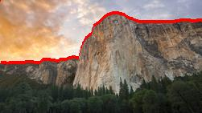
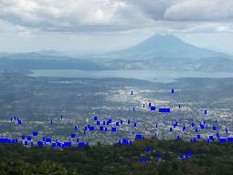
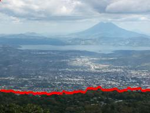
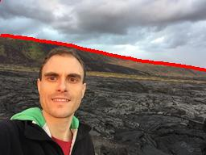
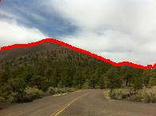
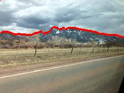

This is an image classification problem is forumulated as an HMM, and uses the Viterbi Algorithm to find the answer. The goal space is an array where each element in it is an integer, corresponding to the location of an edge in the target image. The observation space is a 2-d array of constrast values taken from the picture itself. Since we can't see the edge directly (it is the hidden layer of our model), we must instead observe the matrix of constrast values. 

This program has 3 functions that attempt to find the ridge in the photo with three different techniques. The first is simply taking the argmax of a given column, and though this performs fairly well, it doesn't take in to account keeping a consistent line. The next function uses the Viterbi algorithm, and the third uses the Viterbi algorithm with human influence. For the Viterbi algorithm functions, the transition function is created by comparing the state of the previous column to the current state. If they are close together, then a fairly large percentage is returned, if they are far apart, a much smaller percentage. The emission function is based off of the observed values from the edge_strength map. If they are relatively similar, we return a large result. 

Below is a selection of outputs from the program. 

Image 1 Simple:

Image 1 Viterbi:

Image 2 Simple:

Although the simple algorithm worked well for the first test image, it performs far worse in this case, since the lower section of this image is much noisier. 

Image 2 Viterbi:

Although the program does not identify what humans immediately recognize as the mountain in this picture, it does identify the strongest ridge in the picture and follows it across, which is a large improvement over the simple solution.   

Image 8 Viterbi:

Image 5 Viterbi:

Image 4 Viterbi:

