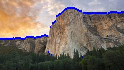

# Part 1
The problem in Part 1 involved us creating an AI to solve an imaginary game, IJK. This game is a two player game where the goal is to be the first player to reach the letter K. Since each player was trying to win, our implementation of AI used alpha-beta to calculate the best move at any given time. To do this, we set an arbitrary depth (in this case it was 7) and our program will play all possible moves in the game until it reaches the set depth. Once there, it will evaluate each space using our heuristic to determine how good it is. If the heuristic for the board is high, it was better for player 1. If it was low, then the board is better for player 2. Then, our AI would calculate the optimal moves to make to reach the most favored board, assuming the opponent is playing as optimally as possible. This program is very effective, since it can look at far more possibilites than a human and make an optimal move using these. The decisions we had to make mostly came from which algorithm to implement, and then what heuristic to make for it. While we attempted a few, we ended up using a simple one that assigned points based on the letters on the board. For instance, if three letters were on the board (a, a, and D), we would say player 1 is doing better since D is a much more difficult letter to reach than a. A few other heuristics were attempted that looked at positioning, but in practice a better position was not worth the benefit of a optimal combination or move.

# Part 2

The image classification problem is forumulated as an HMM, and uses the Viterbi Algorithm to find the answer. The goal space is an array where each element in it is an integer, corresponding to the location of an edge in the target image. The observation space is a 2-d array of constrast values taken from the picture itself. Since we can't see the edge directly (it is the hidden layer of our model), we must instead observe the matrix of constrast values. 

Our program has 3 functions that attempt to find the ridge in the photo with three different techniques. The first is simply taking the argmax of a given column, and though this performs fairly well, it doesn't take in to account keeping a consistent line. The next function uses the Viterbi algorithm, and the third uses the Viterbi algorithm with human influence. For the Viterbi algorithm functions, we created the transition function by comparing the state of the previous column to the current state. If they are close together, we return a fairly large percentage, if they are far apart, a much smaller percentage. The emission function is based off of the observed values from the edge_strength map. If they are relatively similar, we return a large result. We created the functions with a lot of trial and error, and simply tried a range of values to see what gave us the best fits on our test images. 

While we were in the process of trying these different values, our team ended up re-implementing the Viterbi algorithm a slightly different way to ensure there weren't any bugs with the algorithm implmentation itself. 

One challenge we faced was for the human-influenced viterbi algorithm. Our goal was to return a large number for the row and column specified by the user, but in practice we had trouble getting this to work. 

Below is a selection of outputs from our program. 

Image 1 Simple:

Image 1 Viterbi:

Image 2 Simple:

Although the simple algorithm worked well for the first test image, it performs far worse in this case, since the lower section of this image is much noisier. 

Image 2 Viterbi:

Although the program does not identify what we immediately recognize as the mountain in this picture, it does identify the strongest ridge in the picture and follow it across, which is a large improvement over the simple solution.   

Image 8 Viterbi:

Image 5 Viterbi:

Image 4 Viterbi:

